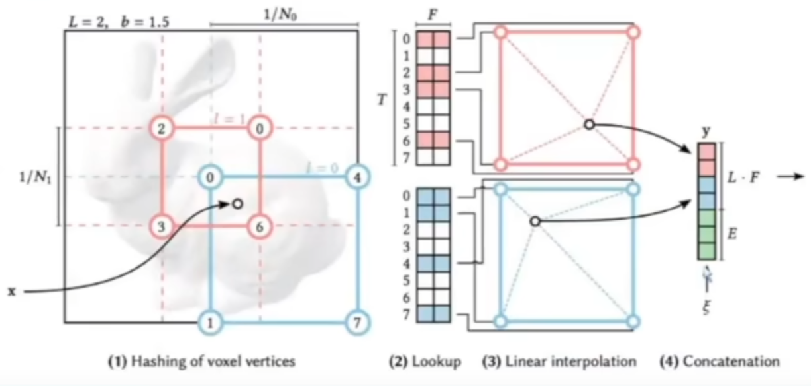
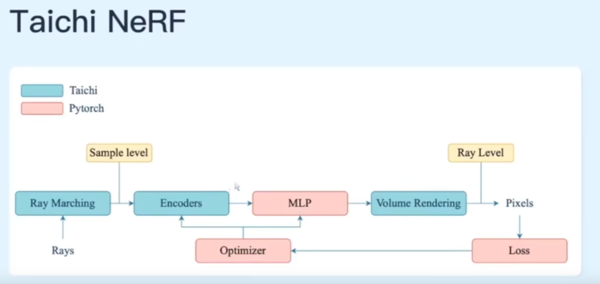
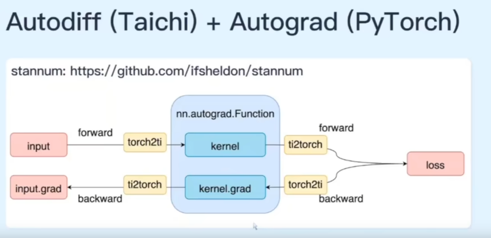
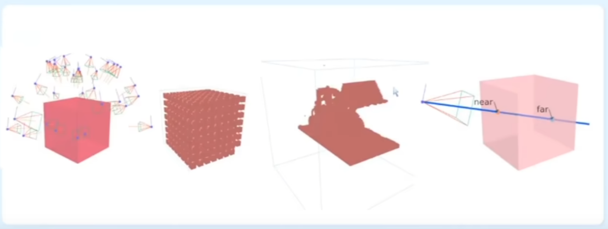
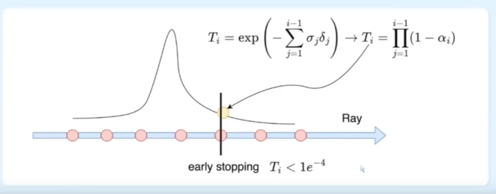

<!-- omit in toc -->
# :cyclone: Instant NGP with Taichi
This document records the basic understanding and implementations for Instant NGP with [Taichi](https://github.com/taichi-dev/taichi-nerfs).

- Instant NGP: 
  1) "Occupancy Grid" for accelerations of NeRF's training
  2) "Hash Encoder" for accelerations of NeRF's convergence rate 

- NeRF Pipeline:

Generally, there are several components in the NeRF including "Positional Encoding", "The Radiance Field Function Approximator", "Differentiable Volume Renderer", "Stratified Sampling", and "Hierarchical Volume Sampling".

- Ray Marching for Rendering Results:
   - Early Stop with High Opacity

---
## Volumetric Rendering
Here attached an implementation and tutorials of Volumetric Rendering in [Shadertoy](https://disigns.wordpress.com/portfolio/shadertoy-glsl-demos/) for practice and reviews.

Volume rendering is a technique for visualizing sampled functions of a colored semi transparent volume. Unlike hard surface rendering, Volumetric rendering evaluates light rays as they pass through the volume. This generally means evaluating **Opacity** and a **Color** for each pixel that intersects the volume.

---
## Stratified Sampling
Check [wiki] for detail information. Rather than simply drawing samples at regular spacing, the stratified sampling approach allows the model to sample a continuous space, therefore conditioning the network to learn over a continuous space. More things about ray sampling could be found [here](https://docs.nerf.studio/en/latest/nerfology/model_components/visualize_samplers.html).

---
## Spatial Distortions
When rendering a target view of a scene, the camera will emit a camera ray for each pixel and query the scene at points along this ray. We can choose where to query these points using different samplers. These samplers have some notion of bounds that define where the ray should start and terminate. If you know that everything in your scenes exists within some predefined bounds (ie. a cube that a room fits in) then the sampler will properly sample the entire space. If however the scene is unbounded (ie. an outdoor scene) defining where to stop sampling is challenging. One option to increase the far sampling distance to a large value (ie. 1km). Alternatively **we can warp the space into a fixed volume**. Below are supported distortions.

---
## Position Encoding
A more detail tutorial could be found [here](https://dtransposed.github.io/blog/2022/08/06/NeRF/) for using position encoding to capture details of Radiance Fields. 

