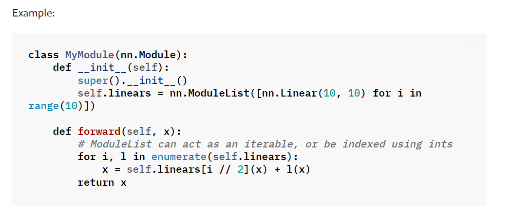

<!-- omit in toc -->
# :running_man: Pytorch Reviews for Deep Learning
This repository is maintained as a learning record for pytorch coding in deep learning areas.

- [:corn: Great Tutorials](#corn-great-tutorials)
- [:light\_rail: Basic Concepts](#light_rail-basic-concepts)
  
Implement deep-learning based methods by following mini structure designs:

- Datasets
- Networks
- Evaluators
- Trainers
- Visualizers
  
---
# :corn: Great Tutorials

- [Pytorch Implementations of Basic Deep Learning Models](https://github.com/yunjey/pytorch-tutorial) :star:
- [Pytorch Video Tutorial](https://github.com/patrickloeber/pytorchTutorial)
- [Pytorch for Deep Learning in Kaggle](https://www.kaggle.com/code/kanncaa1/pytorch-tutorial-for-deep-learning-lovers) :star:
- [Deep Learning Paper Implementations](https://github.com/labmlai/annotated_deep_learning_paper_implementations)

# :light_rail: Basic Concepts

- Basic operations could be checked in the [tensors.py](./pytorch/tensors.py).

- [ModuleList](https://pytorch.org/docs/stable/generated/torch.nn.ModuleList.html) can be index like a regular Python list and could be retrieved as Module method with index access.

- [Cumulative Product](https://pytorch.org/docs/stable/generated/torch.cumprod.html) Returns the cumulative product of elements of input in the dimension dim. For example, if input is a vector of size N, the result will also be a vector of size N, with elements. 
  

- [Expand](https://pytorch.org/docs/stable/generated/torch.Tensor.expand.html) returns a new view of the self tensor with singleton dimension expanded to a larger size. Remember it only creates a view for the tensor without allocating further [memory](https://discuss.pytorch.org/t/expand-on-non-singleton-dimensions-without-actually-repeating-the-memory/11301) and hence it is very useable for read-only situations.
  
- Be careful that lots's problems come from the environment settings like no third-party packages, not correct versions of imported packages and CUDA compatibility. Be patient and utilize the anaconda virtual environments to reset all the environments and try it again. :smile:

  
